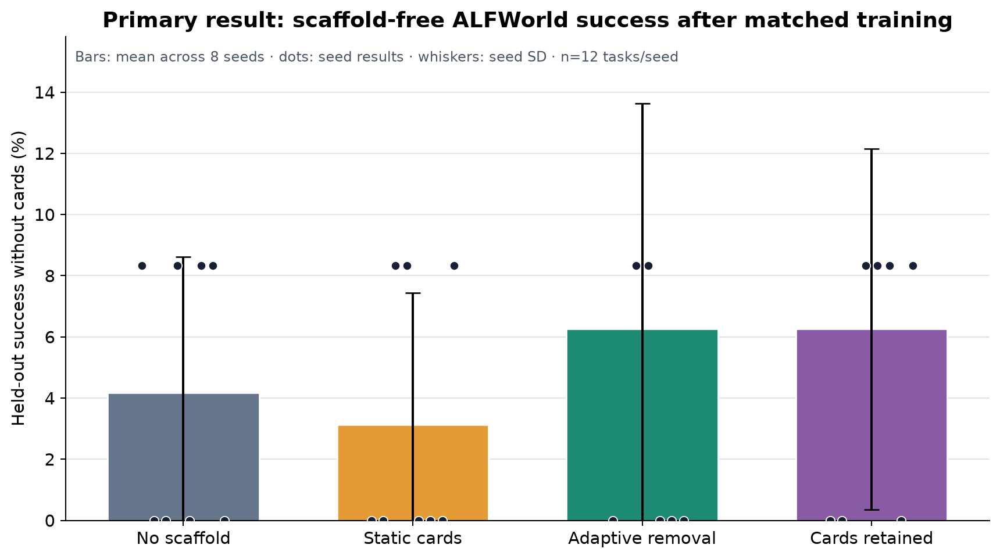
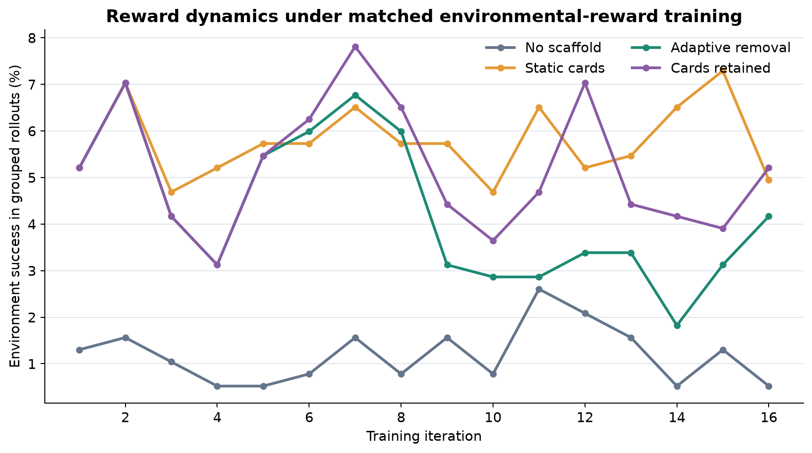
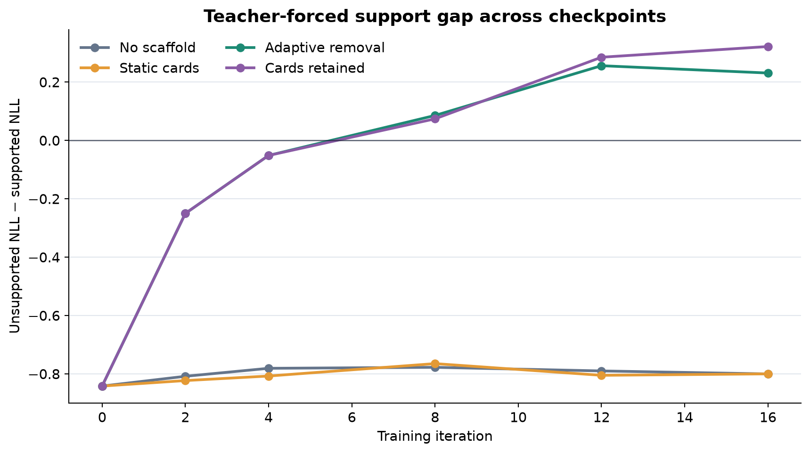
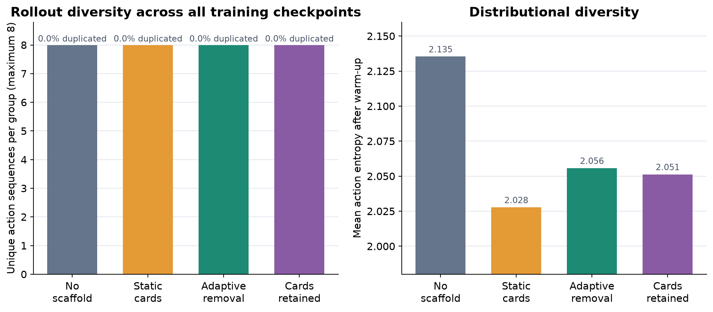
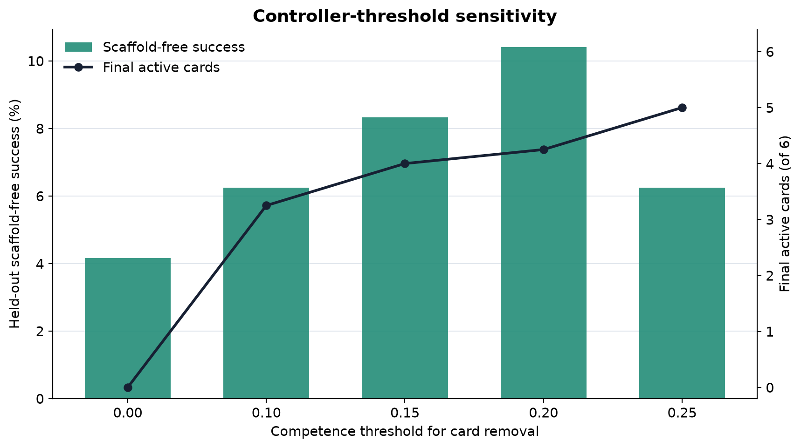

# PATS on ALFWorld: do temporary hints become unaided skill?

Training an agent to solve household tasks by trial and error can stall before it ever discovers a reward. PATS proposes giving the learner temporary, experience-based hints, then withdrawing them as behavior improves so that the policy—not the hints—does the work. We tested that causal story on a fixed public ALFWorld subset by asking whether adaptive removal beats equal-budget training and static guidance when every final evaluation hides the hints.

**Verdict: partially reproduced.** Across eight matched seeds, adaptive removal achieved **6.25%** scaffold-free held-out success (6/96 episodes), compared with **4.17%** for no-scaffold RLVR (4/96) and **3.13%** for static cards (3/96). It tied permanently retained policy-aware cards at **6.25%**. The primary comparison is directionally aligned, but the margin is only two and three episodes, and removal itself did not improve success over retention.

**Scope.** This reduced test used eight seeds, six fixed training tasks, twelve fixed `valid_unseen` tasks, and 16 training iterations per seed. It is not a numerical replication of the paper's full ALFWorld campaign.



**How to read this figure.** Bars average eight seeds, dots are seed results, and whiskers are seed standard deviations. Every condition used identical tasks and rollout budget; “without cards” means no evidence card was present at evaluation. Adaptive removal exceeds the two requested RLVR/static controls but ties retained guidance, with substantial seed variation.

[](https://molab.marimo.io/github/alphaXiv/pats-policy-aware-training-scaffolding-for-agent/blob/main/notebooks/pats_alfworld_reproduction.py)

## What was tested

The reconstruction uses public ALFWorld 0.3.5 TextWorld and Qwen2.5-1.5B-Instruct with a rank-16 LoRA adapter. One training task from each of six families supplies binary environment reward; two unseen tasks per family are held out. The policy scores ALFWorld's admissible actions, samples eight complete trajectories per task and iteration, and receives the same group-relative reinforcement update in every arm.

No author code is available, so missing evidence-card details were made explicit. We executed ALFWorld's public expert-plan metadata once per training task, accepted it only when the environment reported success, and compressed the trace into a family card. Static cards never change. Policy-aware cards are revised from recent outcomes; adaptive training removes a card after a four-iteration warm-up when its success moving average reaches 0.25, while the retained arm disables removal.

```text
verified ALFWorld trace → evidence card → grouped rollouts
environment reward → group-relative LoRA update
recent competence → revise/remove card → card-free evaluation
```



During training, mean rollout success was 5.76% with static cards, 5.19% with retained cards, 4.28% with adaptive removal, and 1.19% without scaffolding. Guidance therefore improved reward discovery; adaptive performance fell between permanent guidance and no guidance as cards were removed.

## Claim-by-claim evidence

| Claim | Paper | This reproduction | Assessment |
|---|---:|---:|---|
| PATS improves ALFWorld success over equal-budget RL | 80.71% vs 67.86% GRPO | 6.25% vs 4.17% | **Aligned direction; small margin** |
| PATS improves over static warm-start guidance | 80.71% vs 70.24% | 6.25% vs 3.13% static cards | **Aligned; reconstructed control** |
| Removal closes the support-likelihood gap | 0.1170 → 0.0723 (38.2%) | 0.842 → 0.242 (71.2%); retained ends at 0.322 | **Aligned, not removal-exclusive** |
| Removal preserves greater rollout diversity than retained guidance | greater diversity reported | both 8/8 unique; post-warm-up action entropy 2.056 vs 2.051 | **Trajectory metric inconclusive; entropy weakly aligned** |



The signed diagnostic is unsupported negative log-likelihood minus supported negative log-likelihood; zero means the card no longer changes the fixed expert action's likelihood. Adaptive removal ended closer to zero than retention on average, although both crossed zero in several seeds. This supports support-gap contraction, not a uniquely removal-caused mechanism.



Every arm produced eight distinct complete trajectories per group and 0% duplication, so the requested trajectory measure is at a ceiling. Adaptive removal has only a 0.005-nat entropy advantage over retention after warm-up—directionally consistent, but too small to establish greater exploration.

## Robustness and limits



The controller is sensitive to timing. In a separate four-seed sweep, removing all cards at iteration 4 produced 4.17% success; thresholds 0.10, 0.15, and 0.20 produced 6.25%, 8.33%, and 10.42%. The predeclared 0.25 threshold also reached 10.42% in its first four seeds, but fell to 6.25% after the fresh seed extension. The sweep suggests gradual withdrawal can help, while also showing substantial small-sample volatility.

The reconstruction uses six rather than hundreds of training tasks, 16 rather than 150 iterations, admissible-action scoring rather than unconstrained generation, and an oracle-like audited expert trace rather than the paper's learned experience bank. The fixed evaluation tasks aid matching but are not 96 independent task draws; WebShop and search were not tested. An env-prefixed dispatch was cancelled and excluded after violating the invariant-command protocol; all included extension seeds were rerun from distinct committed configs with `bash scripts/run.sh`.

All evidence ran on **OpenResearch Kubernetes** using **NVIDIA RTX PRO 6000 Blackwell** GPUs, with a peak of **16 concurrent GPUs** and **6.153805 actual elapsed wall-hours** from the first successful recovery run to the last included completion. Terminal logs are frozen in the [result JSON](data/results.json), and the [self-contained notebook](../../notebooks/pats_alfworld_reproduction.py) exposes seed-level evidence without rerunning training.

## Bottom line

At this scale, temporary policy-aware scaffolding beat matched no-scaffold and static controls and produced the strongest support-gap contraction, partially reproducing the central claim. It did not beat retained guidance on scaffold-free success, and complete-trajectory diversity was indistinguishable. A full reproduction still needs the 150-step setup, author-equivalent card construction, unconstrained generation, and broader held-out evaluation.

Experiment lineage: [no scaffold](https://github.com/alphaXiv/pats-policy-aware-training-scaffolding-for-agent/tree/orx/audited-no-scaffold-seed-0), [static cards](https://github.com/alphaXiv/pats-policy-aware-training-scaffolding-for-agent/tree/orx/audited-static-audited-cards-seed-0), [adaptive removal](https://github.com/alphaXiv/pats-policy-aware-training-scaffolding-for-agent/tree/orx/audited-adaptive-removal-audited-cards-seed-0), [retained cards](https://github.com/alphaXiv/pats-policy-aware-training-scaffolding-for-agent/tree/orx/audited-adaptive-retained-audited-cards-seed-0), and [valid seed extension](https://github.com/alphaXiv/pats-policy-aware-training-scaffolding-for-agent/tree/orx/valid-extended-adaptive-seed-4).
